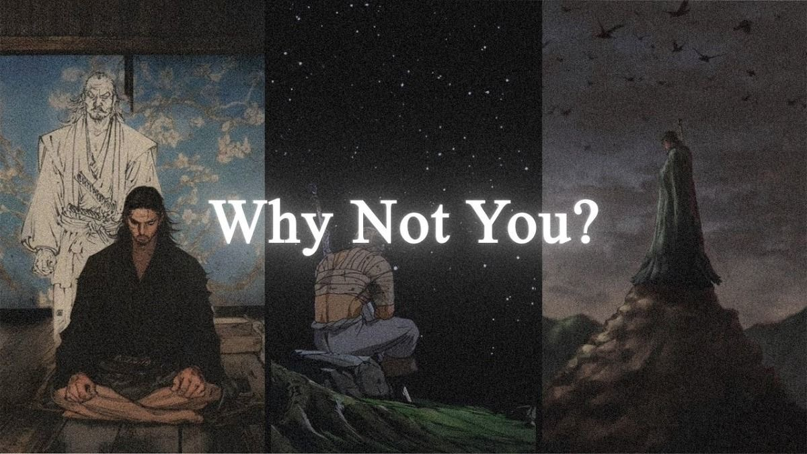

  

<h1 align="center" style="color:#D4AF37;">
  👋 Hi, I’m 
  <a href="https://github.com/MugilMs" target="_blank" style="color:#FFD700;">
    Mugil Ms
  </a>
</h1>

  

### ⚔️ About Me  
- High-performance apps → **Flutter & React**  
- Security architect → cybersecurity with intent  
- Blockchain explorer → forward-driven innovation  
- Inspired by **samurai discipline, desert calm, warrior elegance**  
- Code practiced like a martial art

---

### 🛠️ Tech Stack  

  

---

### 📊 GitHub Stats  

  
  

---

### 📈 Contribution Graph  

  

---

### 🌐 Connect With Me  

  
  

---

  
    ✨ “Why not you? Precision in silence. Impact in execution.” ⚔️
  

